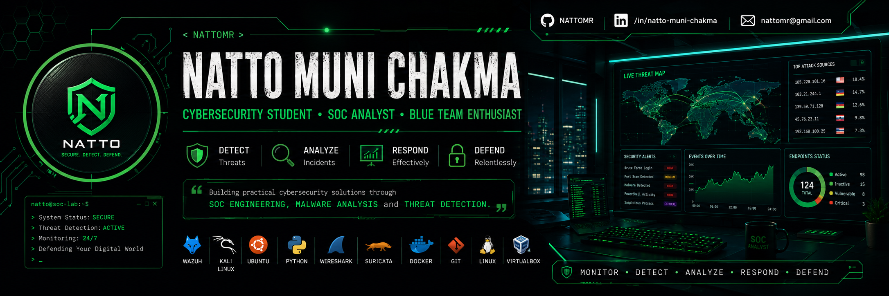

  

👋 Hi, I'm Natto Muni Chakma

Cybersecurity Student | SOC Analyst | Malware Researcher

🏆 ICCR Scholar
🎓 Andhra University
🛡️ Blue Team Enthusiast
🔍 Malware Analysis
⚡ Wazuh • Splunk • Suricata • Kali Linux

--------------------------------------------------------
About Me
--------------------------------------------------------

I build cybersecurity home labs,
analyze malware,
investigate attacks,
and create detection rules.

Currently working on:

• Wazuh SOC Home Lab
• Hybrid Android Malware Detection
• Threat Detection
• Digital Forensics

--------------------------------------------------------
Skills
--------------------------------------------------------

🖥️ Operating Systems
Windows
Ubuntu
Kali Linux

🛡️ Security
Wazuh
Splunk
Wireshark
Suricata
Sysmon
YARA
Velociraptor
Sigma

💻 Programming
Python
Bash
Java
C++

☁️ Others
Git
GitHub
Docker
VirtualBox

--------------------------------------------------------
Projects
--------------------------------------------------------

🔥 Wazuh SOC Home Lab
🔥 Android Malware Detection
🔥 Nessus Vulnerability Assessment
🔥 Wireshark Network Analysis
🔥 Phishing Detection

--------------------------------------------------------
GitHub Stats

Stats
Languages
Contribution Graph

--------------------------------------------------------
Connect

LinkedIn
Portfolio
Email
