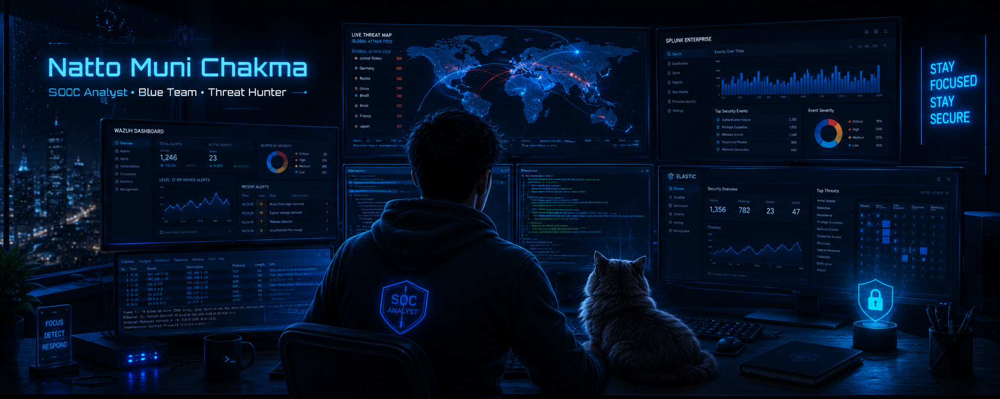
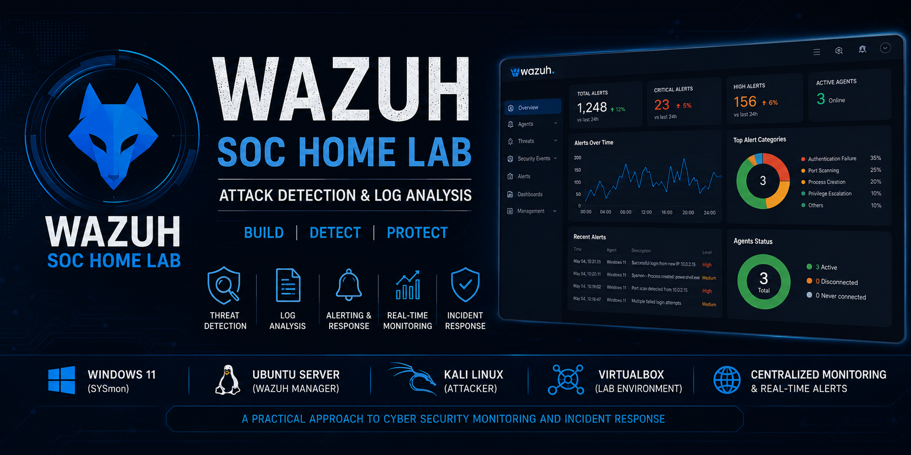
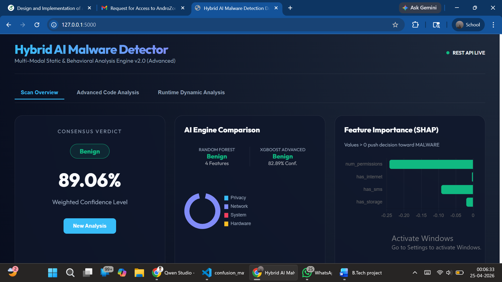
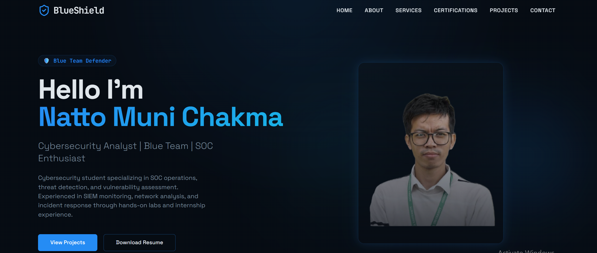

<!-- ========================================================= -->
<!--                         HERO SECTION                       -->
<!-- ========================================================= -->

<p align="center">
  
</p>

<h1 align="center">
Hi 👋, I'm Natto Muni Chakma
</h1>

<h3 align="center">
• SOC Analyst • Blue Team Enthusiast
</h3>

<p align="center">
Building practical cybersecurity projects focused on
<strong>Threat Detection</strong>,
<strong>Security Operations (SOC)</strong>,
<strong>Malware Analysis</strong>,
and <strong>Detection Engineering</strong>.
</p>

<p align="center">

</p>

<p align="center">


</p>

---

## 🚀 About Me

<table>
<tr>
<td width="50%">

🎓 **Final Year B.Tech CSE Student**

🏆 **ICCR Scholar**

🛡 **SOC Home Lab Builder**

🔍 **Blue Team Enthusiast**

</td>

<td width="50%">

🐍 **Python Developer**

🐧 **Linux Enthusiast**

📊 **SIEM & Threat Detection**

⚡ **Always Learning**

</td>
</tr>
</table>

---

## 🎯 Current Focus

<p align="left">


</p>

---

## 💻 Programming & Development

<p align="center">


</p>

---

## 🖥 Operating Systems

<p align="center">


</p>

---

## 🛠 Development Tools

<p align="center">


<!-- ========================================================= -->
<!--                   FEATURED PROJECTS                        -->
<!-- ========================================================= -->

# 🚀 Featured Projects

<table>
<tr>

<td width="50%" valign="top">

## 🛡 Wazuh SOC Home Lab

<a href="https://github.com/NATTOMR/NATTOMR/blob/main/assets/wazuh-dashboard01.png">

</a>

Enterprise-grade SOC using

- Ubuntu Server
- Wazuh
- Windows 11
- Kali Linux

<p align="center">

<a href="https://github.com/NATTOMR/Design-and-Implementation-of-a-Wazuh-Based-SOC-Home-Lab-for-Attack-Detection-and-Log-Analysis">


</a>

</p>

</td>

<td width="50%" valign="top">

## 🤖 Android Malware Detection

<a href="YOUR_REPO_LINK">

</a>

Hybrid malware detection using

- Python
- Androguard
- XGBoost

<p align="center">

<a href="YOUR_REPO_LINK">


</a>

</p>

</td>

</tr>

<tr>

<td width="50%" valign="top">

## 🌐 Portfolio Website

<a href="YOUR_REPO_LINK">

</a>

Next.js Portfolio

Tailwind CSS

Responsive Design

<p align="center">

<a href="YOUR_REPO_LINK">


</a>

</p>

</td>

<td width="50%" valign="top">

## 📡 Network Analysis

<a href="YOUR_REPO_LINK">

</a>

Network Monitoring

Wireshark

Packet Analysis

<p align="center">

<a href="YOUR_REPO_LINK">


</a>

</p>

</td>

</tr>

</table>

### 📖 Overview

Designed and implemented a complete Security Operations Center (SOC) home lab using Wazuh for centralized log collection, threat detection, endpoint monitoring, and security event analysis.

### ⚙ Technologies

<p>


</p>

### ⭐ Highlights

- Security Operations Center (SOC)
- Threat Detection
- Attack Simulation
- Log Analysis
- Endpoint Monitoring
- MITRE ATT&CK Mapping

<p>

<a href="YOUR_WAZUH_REPOSITORY">


</a>

</p>

---

## 🤖 Hybrid Android Malware Detection System

<p align="center">


</p>

### 📖 Overview

Developed a hybrid Android malware detection system combining reverse engineering techniques with machine learning for malware classification.

### ⚙ Technologies

<p>


</p>

### ⭐ Highlights

- Static Analysis
- Reverse Engineering
- Feature Extraction
- Malware Classification
- Machine Learning

<p>

<a href="YOUR_ANDROID_REPOSITORY">


</a>

</p>

---

## 🌐 Portfolio Website

<p align="center">


</p>

### 📖 Overview

Personal portfolio website showcasing projects, certifications, technical skills, and cybersecurity experience.

### ⚙ Technologies

<p>


</p>

<p>

<a href="YOUR_PORTFOLIO_REPOSITORY">


</a>

</p>

<!-- ========================================================= -->
<!--                  GITHUB ANALYTICS                         -->
<!-- ========================================================= -->

# 📊 GitHub Analytics

<p align="center">
A quick overview of my GitHub activity, programming languages, contribution history, and development consistency.
</p>

---

## 📈 GitHub Statistics

<p align="center">


</p>

---

## 🔥 Contribution Streak

<p align="center">


</p>

---

## 📈 Contribution Activity

<p align="center">


</p>

---

## 🏆 GitHub Achievements

<p align="center">


</p>

---

## 🐍 Contribution Snake

<p align="center">


</p>

> **Note:** This animation will work after we configure a GitHub Action in your repository.

---

## 📌 Development Summary

<table>
<tr>
<td width="50%">

### 💻 Programming

- Python
- Java
- Bash
- C
- C++
<!-- ========================================================= -->
<!--                    SECURITY STACK                         -->
<!-- ========================================================= -->

# 🛡 Security Stack

<p align="center">
Technologies, platforms, and tools I use for building cybersecurity labs and security research.
</p>

<table>
<tr>

<td width="33%" valign="top">

## 🛡 SIEM

<p align="center">


</p>

- **Wazuh**
- **Splunk**
- **OpenSearch**
- **Kibana**

</td>

<td width="33%" valign="top">

## 🌐 Network Security

<p align="center">


</p>

- **Wireshark**
- **Nmap**
- **Suricata**
- **TCPDump**

</td>

<td width="33%" valign="top">

## 🔍 Threat Detection

<p align="center">


</p>

- **Sysmon**
- **Sigma**
- **YARA**
- **MITRE ATT&CK**

</td>

</tr>

<tr>

<td width="33%" valign="top">

## 💻 Operating Systems

<p align="center">


</p>

- Ubuntu Server
- Kali Linux
- Windows 11

</td>

<td width="33%" valign="top">

## 🐳 DevOps

<p align="center">


</p>

- Docker
- Git
- GitHub

</td>

<td width="33%" valign="top">

## 🐍 Programming

<p align="center">


</p>

- Python
- Bash
- Java

</td>

</tr>

</table>
---

<!-- ========================================================= -->
<!--           CERTIFICATIONS & LEARNING                       -->
<!-- ========================================================= -->

# 🎓 Certifications

<p align="center">


</p>

> **More certifications will be added as I continue learning and expanding my cybersecurity expertise.**

---

# 📚 Currently Learning

<table>
<tr>

<td width="33%" align="center">

### 🛡 Blue Team

Threat Hunting

Detection Engineering

SOC Operations

</td>

<td width="33%" align="center">

### 🔍 Malware

Reverse Engineering

Static Analysis

Dynamic Analysis

</td>

<td width="33%" align="center">

### ☁ Cloud

AWS Security

Microsoft Sentinel

Cloud SOC

</td>

</tr>
</table>

---

# 🎯 Career Goal

> To become a **Security Operations Center (SOC) Analyst** and **Detection Engineer**, building practical security solutions that improve threat detection, incident response, and cyber defense.

---

# 🏆 GitHub Highlights

- 🛡️ Wazuh-Based SOC Home Lab
- 🤖 Hybrid Android Malware Detection System
- 🌐 Personal Portfolio Website
- 🔍 Malware Analysis
- 📊 Threat Detection & Log Analysis
- 🐍 Python Automation
- 🖥 Linux System Administration

---

# 📅 Roadmap

```text
2026
│
├── ✅ Build Wazuh SOC Home Lab
│
├── ✅ Complete Android Malware Detection Project
│
├── 🔄 Detection Engineering
│
├── 🔄 Threat Hunting
│
├── 🔄 Cloud Security
│
└── 🎯 Cybersecurity Internship
```

---

# 🤝 Let's Connect

<p align="center">

<a href="YOUR_GITHUB_URL">

</a>

<a href="YOUR_LINKEDIN_URL">

</a>

<a href="YOUR_PORTFOLIO_URL">

</a>

<a href="mailto:YOUR_EMAIL">

</a>

</p>

---

# 💬 Favorite Quote

<p align="center">

> **"Security is not a product, but a continuous process of learning, adapting, and improving."**

</p>

---

<div align="center">

## ⭐ Thank you for visiting my profile!

If you like my work, consider ⭐ starring my repositories.


</div>
