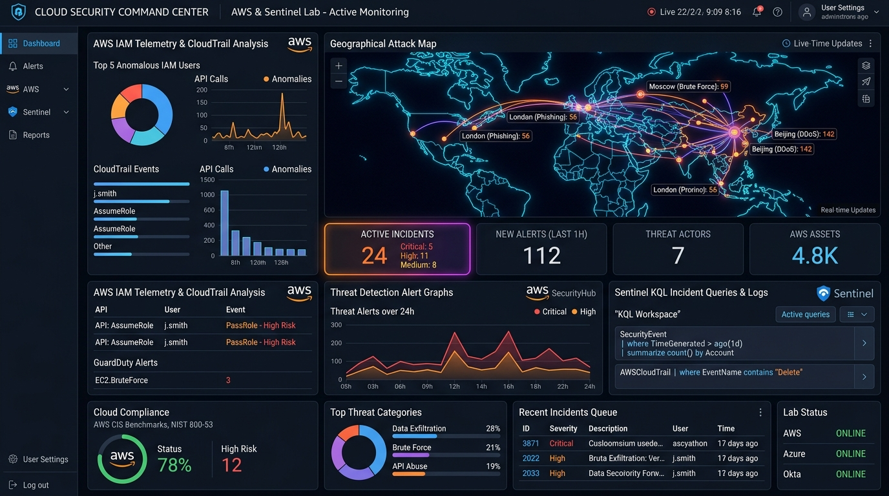

<!-- ========================================================= -->
<!--                         HERO SECTION                       -->
<!-- ========================================================= -->

  

<h1 align="center">
  𝗛𝗶, 𝗜'𝗺 𝗡𝗮𝘁𝘁𝗼 𝗠𝘂𝗻𝗶 𝗖𝗵𝗮𝗸𝗺𝗮
</h1>

<h3 align="center">
  𝗦𝗢𝗖 & 𝗕𝗹𝘂𝗲 𝗧𝗲𝗮𝗺 𝗘𝗻𝘁𝗵𝘂𝘀𝗶𝗮𝘀𝘁 | 𝗗𝗲dication in Blue team field
</h3>

  Building practical cybersecurity projects focused on
  <strong>Threat Detection</strong>,
  <strong>Security Operations (SOC)</strong>,
  <strong>Malware Analysis</strong>,
  and <strong>Detection Engineering</strong>.

  
  &nbsp;
  

  
  &nbsp;
  
  &nbsp;
  
  &nbsp;
  

---

## 🚀 𝗔𝗯𝗼𝘂𝘁 𝗠𝗲

I am a **Computer Science & Engineering Graduate (2026)** and dedicated **Cybersecurity & SOC Analyst** focused on defensive security, SIEM log analysis, and incident response.

* 🏆 **𝗪𝗵𝗮𝘁 𝗜 𝗛𝗮𝘃𝗲 𝗗𝗼𝗻𝗲** — Earned Google Cybersecurity & NPTEL Elite Ethical Hacking (60%, IIT Kharagpur) credentials. Awarded Best Performer at Elevate Labs (Skill India) and built multi-OS Wazuh & Sysmon detection labs.
* ⚡ **𝗪𝗵𝗮𝘁 𝗜 𝗔𝗺 𝗗𝗼𝗶𝗻𝗴 𝗖𝘂𝗿𝗿𝗲𝗻𝘁𝗹𝘆** — Practicing alert triage and incident response on TryHackMe, Hack The Box, and LetsDefend. Writing Python security automation scripts and developing Sigma & YARA detection rules.
* 🎯 **𝗪𝗵𝗮𝘁 𝗜𝘀 𝗠𝘆 𝗙𝘂𝘁𝘂𝗿𝗲 𝗚𝗼𝗮𝗹** — Targeting Tier-1/Tier-2 SOC Analyst and Security Engineer roles in enterprise defense. Preparing for CompTIA Security+, CySA+, and BTL1 certifications to advance in detection engineering.

---

## 🎯 𝗖𝘂𝗿𝗿𝗲𝗻𝘁 𝗙𝗼𝗰𝘂𝘀

  
  
  
  
  
  
  

---

<!-- ========================================================= -->
<!--                   FEATURED PROJECTS                        -->
<!-- ========================================================= -->

# 🚀 𝗙𝗲𝗮𝘁𝘂𝗿𝗲𝗱 𝗣𝗿𝗼𝗷𝗲𝗰𝘁𝘀

  <code>Endpoint Security</code> ➔ <code>SIEM / SOC</code> ➔ <code>Threat Hunting</code> 
  ➔ <code>Malware Research</code> ➔ <code>Cloud Security</code> ➔ <code>Cloud SOC</code>

<table width="100%">
<tr>
<td valign="top">

  
  <h3>🛡️ 𝗪𝗮𝘇𝘂𝗵 𝗦𝗢𝗖 𝗛𝗼𝗺𝗲 𝗟𝗮𝗯</h3>

  End-to-end virtual SOC telemetry environment utilizing <b>Wazuh Manager</b> on Ubuntu Server to monitor Windows 11 endpoint telemetry and Sysmon event logs against simulated MITRE ATT&amp;CK tactics.

  
  
  
  

  

</td>
</tr>
</table>

<table width="100%">
<tr>
<td valign="top">

  
  <h3>🖥️ 𝗦𝗽𝗹𝘂𝗻𝗸 𝗦𝗢𝗖 &amp; 𝗧𝗵𝗿𝗲𝗮𝘁 𝗛𝘂𝗻𝘁𝗶𝗻𝗴 𝗟𝗮𝗯</h3>

  Real-time SOC monitoring lab simulating and correlating brute-force authentication attempts from Kali Linux against an Ubuntu victim using <b>Splunk Enterprise</b> and custom geo-IP dashboards.

  
  
  
  

  

</td>
</tr>
</table>

<table width="100%">
<tr>
<td valign="top">

  
  <h3>🤖 𝗔𝗻𝗱𝗿𝗼𝗶𝗱 𝗠𝗮𝗹𝘄𝗮𝗿𝗲 𝗖𝗹𝗮𝘀𝘀𝗶𝗳𝗶𝗲𝗿</h3>

  Machine-learning-driven mobile security system automating APK static reverse engineering via <b>Androguard</b> and <b>XGBoost</b> / <b>Random Forest</b> classification with &gt;95% benchmark accuracy.

  
  
  
  

  

</td>
</tr>
</table>

<table width="100%">
<tr>
<td valign="top">

  
  <h3>☁️ 𝗖𝗹𝗼𝘂𝗱 𝗦𝗲𝗰𝘂𝗿𝗶𝘁𝘆 𝗟𝗮𝗯</h3>

  Hands-on cloud security lab covering AWS, IAM, cloud detection, Microsoft Sentinel, cloud SOC architecture, threat hunting, and incident response.

  
  
  
  
  
  

  

</td>
</tr>
</table>

  📌 <strong>𝗖𝗵𝗲𝗰𝗸 𝗼𝘂𝘁 𝗺𝘆 𝗽𝗶𝗻𝗻𝗲𝗱 𝗿𝗲𝗽𝗼𝘀𝗶𝘁𝗼𝗿𝗶𝗲𝘀 𝗮𝗯𝗼𝘃𝗲 𝗳𝗼𝗿 𝗳𝘂𝗹𝗹 𝗽𝗿𝗼𝗷𝗲𝗰𝘁 𝗱𝗼𝗰𝘂𝗺𝗲𝗻𝘁𝗮𝘁𝗶𝗼𝗻, 𝗹𝗮𝗯 𝗮𝗿𝗰𝗵𝗶𝘁𝗲𝗰𝘁𝘂𝗿𝗲, 𝗮𝗻𝗱 𝘀𝗼𝘂𝗿𝗰𝗲 𝗰𝗼𝗱𝗲!</strong>

---

<!-- ========================================================= -->
<!--                    SECURITY STACK                         -->
<!-- ========================================================= -->

# 🛡️ 𝗦𝗲𝗰𝘂𝗿𝗶𝘁𝘆 & 𝗧𝗲𝗰𝗵𝗻𝗶𝗰𝗮𝗹 𝗧𝗼𝗼𝗹𝗸𝗶𝘁

<h4 align="center">🛡️ 𝗦𝗜𝗘𝗠 &amp; 𝗦𝗢𝗖 𝗢𝗽𝗲𝗿𝗮𝘁𝗶𝗼𝗻𝘀</h4>

  
  
  
  

<h4 align="center">☁️ 𝗖𝗹𝗼𝘂𝗱 𝗦𝗲𝗰𝘂𝗿𝗶𝘁𝘆</h4>

  
  
  
  

<h4 align="center">🌐 𝗡𝗲𝘁𝘄𝗼𝗿𝗸 𝗦𝗲𝗰𝘂𝗿𝗶𝘁𝘆</h4>

  
  
  

<h4 align="center">🎯 𝗪𝗲𝗯 𝗦𝗲𝗰𝘂𝗿𝗶𝘁𝘆</h4>

  
  

<h4 align="center">🔍 𝗧𝗵𝗿𝗲𝗮𝘁 𝗜𝗻𝘁𝗲𝗹𝗹𝗶𝗴𝗲𝗻𝗰𝗲 &amp; 𝗗𝗲𝘁𝗲𝗰𝘁𝗶𝗼𝗻</h4>

  
  
  

<h4 align="center">🖥️ 𝗢𝗽𝗲𝗿𝗮𝘁𝗶𝗻𝗴 𝗦𝘆𝘀𝘁𝗲𝗺𝘀</h4>

  

<h4 align="center">💻 𝗪𝗲𝗯 𝗧𝗼𝗼𝗹𝘀, 𝗟𝗮𝗻𝗴𝘂𝗮𝗴𝗲𝘀 &amp; 𝗗𝗲𝘃𝗢𝗽𝘀</h4>

  

---

<!-- ========================================================= -->
<!--                  GITHUB ANALYTICS                         -->
<!-- ========================================================= -->

# 📊 𝗚𝗶𝘁𝗛𝘂𝗯 𝗔𝗻𝗮𝗹𝘆𝘁𝗶𝗰𝘀

  A comprehensive overview of my open-source contributions, language distribution, and daily development activity.

  

  

  

<h3 align="center">🐍 𝗖𝗼𝗻𝘁𝗿𝗶𝗯𝘂𝘁𝗶𝗼𝗻 𝗚𝗿𝗮𝗽𝗵 𝗔𝗻𝗶𝗺𝗮𝘁𝗶𝗼𝗻</h3>

  <picture>
    <source media="(prefers-color-scheme: dark)" srcset="https://raw.githubusercontent.com/NATTOMR/NATTOMR/output/github-contribution-grid-snake-dark.svg">
    <source media="(prefers-color-scheme: light)" srcset="https://raw.githubusercontent.com/NATTOMR/NATTOMR/output/github-contribution-grid-snake.svg">
    
  </picture>

---

# 📚 𝗖𝘂𝗿𝗿𝗲𝗻𝘁𝗹𝘆 𝗟𝗲𝗮𝗿𝗻𝗶𝗻𝗴

<table width="100%">
<tr>
<td align="left">
<b>🛡️ 𝗕𝗹𝘂𝗲 𝗧𝗲𝗮𝗺 𝗢𝗽𝗲𝗿𝗮𝘁𝗶𝗼𝗻𝘀</b>

🎯 <b>𝗧𝗵𝗿𝗲𝗮𝘁 𝗛𝘂𝗻𝘁𝗶𝗻𝗴</b> &nbsp;•&nbsp; ⚡ <b>𝗗𝗲𝘁𝗲𝗰𝘁𝗶𝗼𝗻 𝗘𝗻𝗴𝗶𝗻𝗲𝗲𝗿𝗶𝗻𝗴</b> &nbsp;•&nbsp; 📋 <b>𝗦𝗢𝗖 𝗪𝗼𝗿𝗸𝗳𝗹𝗼𝘄𝘀 &amp; 𝗣𝗹𝗮𝘆𝗯𝗼𝗼𝗸𝘀</b> &nbsp;•&nbsp; 🚨 <b>𝗜𝗻𝗰𝗶𝗱𝗲𝗻𝘁 𝗥𝗲𝘀𝗽𝗼𝗻𝘀𝗲</b>

</td>
</tr>
<tr>
<td align="left">
<b>🔬 𝗠𝗮𝗹𝘄𝗮𝗿𝗲 𝗥𝗲𝘀𝗲𝗮𝗿𝗰𝗵</b>

🔬 <b>𝗥𝗲𝘃𝗲𝗿𝘀𝗲 𝗘𝗻𝗴𝗶𝗻𝗲𝗲𝗿𝗶𝗻𝗴</b> &nbsp;•&nbsp; 🔍 <b>𝗦𝘁𝗮𝘁𝗶𝗰 &amp; 𝗗𝘆𝗻𝗮𝗺𝗶𝗰 𝗔𝗻𝗮𝗹𝘆𝘀𝗶𝘀</b> &nbsp;•&nbsp; 💻 <b>𝗕𝗶𝗻𝗮𝗿𝘆 𝗔𝗻𝗮𝗹𝘆𝘀𝗶𝘀</b> &nbsp;•&nbsp; 🧬 <b>𝗠𝗮𝗹𝘄𝗮𝗿𝗲 𝗕𝗲𝗵𝗮𝘃𝗶𝗼𝗿 𝗣𝗿𝗼𝗳𝗶𝗹𝗶𝗻𝗴</b>

</td>
</tr>
<tr>
<td align="left">
<b>☁️ 𝗖𝗹𝗼𝘂𝗱 𝗦𝗲𝗰𝘂𝗿𝗶𝘁𝘆</b>

☁️ <b>𝗔𝗪𝗦 𝗦𝗲𝗰𝘂𝗿𝗶𝘁𝘆 𝗙𝘂𝗻𝗱𝗮𝗺𝗲𝗻𝘁𝗮𝗹𝘀</b> &nbsp;•&nbsp; 🔑 <b>𝗖𝗹𝗼𝘂𝗱 𝗜𝗔𝗠 𝗦𝗲𝗰𝘂𝗿𝗶𝘁𝘆</b> &nbsp;•&nbsp; 📊 <b>𝗖𝗹𝗼𝘂𝗱 𝗟𝗼𝗴𝗴𝗶𝗻𝗴 &amp; 𝗗𝗲𝘁𝗲𝗰𝘁𝗶𝗼𝗻</b> 
🛡️ <b>𝗠𝗶𝗰𝗿𝗼𝘀𝗼𝗳𝘁 𝗦𝗲𝗻𝘁𝗶𝗻𝗲𝗹</b> &nbsp;•&nbsp; 🏗️ <b>𝗖𝗹𝗼𝘂𝗱 𝗦𝗢𝗖 𝗔𝗿𝗰𝗵𝗶𝘁𝗲𝗰𝘁𝘂𝗿𝗲</b> &nbsp;•&nbsp; ⚡ <b>𝗖𝗹𝗼𝘂𝗱 𝗧𝗵𝗿𝗲𝗮𝘁 𝗗𝗲𝘁𝗲𝗰𝘁𝗶𝗼𝗻 &amp; 𝗥𝗲𝘀𝗽𝗼𝗻𝘀𝗲</b>

</td>
</tr>
</table>

---

# 📅 𝟮𝟬𝟮𝟲 𝗥𝗼𝗮𝗱𝗺𝗮𝗽 & 𝗠𝗶𝗹𝗲𝘀𝘁𝗼𝗻𝗲𝘀

*   ✅ **𝗪𝗮𝘇𝘂𝗵 𝗦𝗢𝗖 𝗛𝗼𝗺𝗲 𝗟𝗮𝗯** — Implemented SIEM server, client log monitoring, and active response rule triggers.
*   ✅ **𝗔𝗻𝗱𝗿𝗼𝗶𝗱 𝗠𝗮𝗹𝘄𝗮𝗿𝗲 𝗖𝗹𝗮𝘀𝘀𝗶𝗳𝗶𝗲𝗿** — Engineered static analysis parser and machine learning classification pipeline.
*   ⚡ **𝗗𝗲𝘁𝗲𝗰𝘁𝗶𝗼𝗻 𝗘𝗻𝗴𝗶𝗻𝗲𝗲𝗿𝗶𝗻𝗴** — _In Progress:_ Writing custom Sigma rules and Snort/Suricata signatures for common network/system exploits.
*   ⚡ **𝗧𝗵𝗿𝗲𝗮𝘁 𝗛𝘂𝗻𝘁𝗶𝗻𝗴** — _In Progress:_ Analyzing artifact behavior using Sysmon logs, Event Viewer, and memory dumps.
*   ⚡ **𝗖𝗹𝗼𝘂𝗱 𝗦𝗲𝗰𝘂𝗿𝗶𝘁𝘆 𝗟𝗮𝗯** — _In Progress:_ Hands-on AWS security, IAM, CloudTrail/CloudWatch logging, and Microsoft Sentinel detection. &nbsp;
*   🎯 **𝗘𝗻𝘁𝗿𝘆-𝗟𝗲𝘃𝗲𝗹 𝗦𝗢𝗖 𝗥𝗼𝗹𝗲** — _Target:_ Secure an internship or associate SOC Analyst position to contribute to defensive security.

---

# ⚡ 𝗖𝗼𝗿𝗲 𝗖𝗼𝗺𝗽𝗲𝘁𝗲𝗻𝗰𝗶𝗲𝘀

*   🛡️ **𝗦𝗜𝗘𝗠 & 𝗠𝗼𝗻𝗶𝘁𝗼𝗿𝗶𝗻𝗴** — Log aggregation, rule customisation, dashboard creation (Wazuh, Splunk).
*   🔍 **𝗧𝗵𝗿𝗲𝗮𝘁 𝗔𝗻𝗮𝗹𝘆𝘀𝗶𝘀 & 𝗗𝗲𝘁𝗲𝗰𝘁𝗶𝗼𝗻** — Sigma rule mapping, MITRE ATT&CK mapping, endpoint visibility.
*   🌐 **𝗡𝗲𝘁𝘄𝗼𝗿𝗸 𝗦𝗲𝗰𝘂𝗿𝗶𝘁𝘆** — Traffic capture, packet analysis, Intrusion Detection Systems (Wireshark, Suricata).
*   🔬 **𝗠𝗮𝗹𝘄𝗮𝗿𝗲 𝗔𝗻𝗮𝗹𝘆𝘀𝗶𝘀** — Static APK unpacking, code pattern identification, ML behavior models.
*   ☁️ **𝗖𝗹𝗼𝘂𝗱 𝗦𝗲𝗰𝘂𝗿𝗶𝘁𝘆 (𝗟𝗲𝗮𝗿𝗻𝗶𝗻𝗴 & 𝗟𝗮𝗯𝘀)** — AWS (IAM, CloudTrail, CloudWatch), Microsoft Sentinel, KQL, cloud threat detection & Cloud SOC architecture.
*   🖥️ **𝗦𝘆𝘀𝘁𝗲𝗺𝘀 𝗔𝗱𝗺𝗶𝗻𝗶𝘀𝘁𝗿𝗮𝘁𝗶𝗼𝗻** — Linux terminal operations, bash automation, Windows server basic configuration.

---

  <strong>⭐ 𝗧𝗵𝗮𝗻𝗸 𝘆𝗼𝘂 𝗳𝗼𝗿 𝘃𝗶𝘀𝗶𝘁𝗶𝗻𝗴 𝗺𝘆 𝗽𝗿𝗼𝗳𝗶𝗹𝗲! 𝗜𝗳 𝘆𝗼𝘂 𝗹𝗶𝗸𝗲 𝗺𝘆 𝘄𝗼𝗿𝗸, 𝗰𝗼𝗻𝘀𝗶𝗱𝗲𝗿 𝘀𝘁𝗮𝗿𝗿𝗶𝗻𝗴 𝗺𝘆 𝗿𝗲𝗽𝗼𝘀𝗶𝘁𝗼𝗿𝗶𝗲𝘀.</strong>

