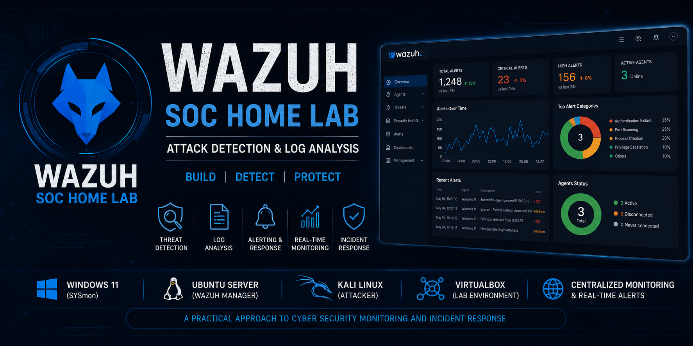
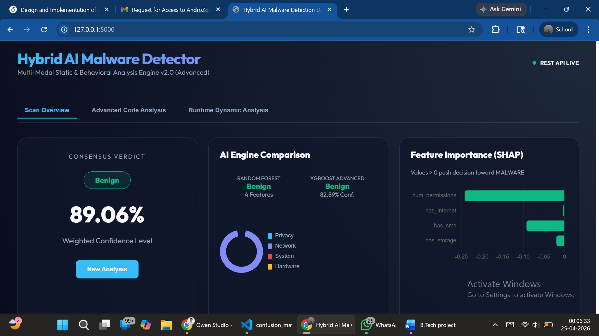
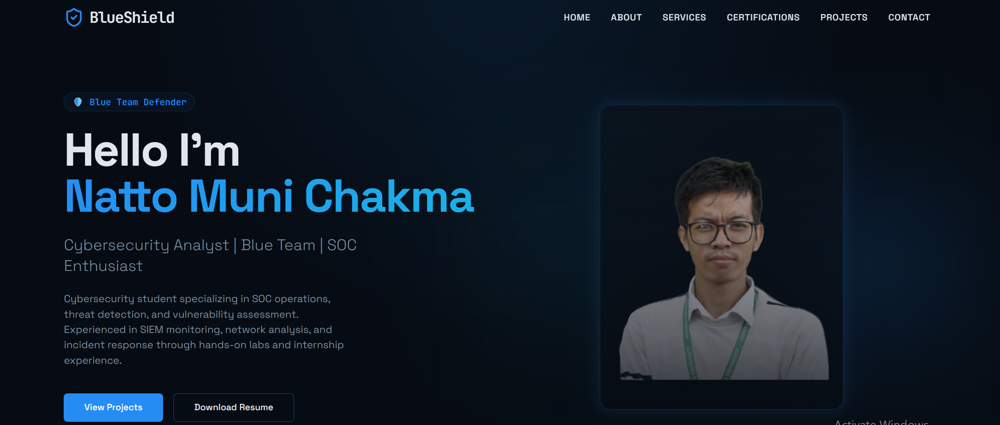

<!-- ========================================================= -->
<!--                         HERO SECTION                       -->
<!-- ========================================================= -->

  

<h1 align="center">
  Hi, I'm Natto Muni Chakma
</h1>

<h3 align="center">
  • SOC Analyst • Blue Team Enthusiast • Detection Engineer
</h3>

  Building practical cybersecurity projects focused on
  <strong>Threat Detection</strong>,
  <strong>Security Operations (SOC)</strong>,
  <strong>Malware Analysis</strong>,
  and <strong>Detection Engineering</strong>.

  

  
  &nbsp;
  

  
  &nbsp;
  
  &nbsp;
  
  &nbsp;
  

---

## 🚀 About Me

I am a **Computer Science & Engineering Graduate (2026)** and dedicated **Cybersecurity & SOC Analyst** focused on defensive security, SIEM log analysis, and incident response.

* 🏆 **What I Have Done** — Earned Google Cybersecurity & NPTEL Elite Ethical Hacking (60%, IIT Kharagpur) credentials. Awarded Best Performer at Elevate Labs (Skill India) and built multi-OS Wazuh & Sysmon detection labs.
* ⚡ **What I Am Doing Currently** — Practicing alert triage and incident response on TryHackMe, Hack The Box, and LetsDefend. Writing Python security automation scripts and developing Sigma & YARA detection rules.
* 🎯 **What Is My Future Goal** — Targeting Tier-1/Tier-2 SOC Analyst and Security Engineer roles in enterprise defense. Preparing for CompTIA Security+, CySA+, and BTL1 certifications to advance in detection engineering.

---

## 🎯 Current Focus

  
  
  
  
  
  

---

<!-- ========================================================= -->
<!--                   FEATURED PROJECTS                        -->
<!-- ========================================================= -->

# 🚀 Featured Projects

<table>
<tr>

<td width="50%" valign="top">

  
  <h3>🛡️ Wazuh SOC Home Lab</h3>

  End-to-end virtual SOC telemetry environment utilizing <b>Wazuh Manager</b> on Ubuntu Server to monitor Windows 11 endpoint telemetry and Sysmon event logs against simulated MITRE ATT&amp;CK tactics.

  
  
  
  

  

</td>

<td width="50%" valign="top">

  
  <h3>🤖 Android Malware Detector</h3>

  Machine-learning-driven mobile security system automating APK static reverse engineering via <b>Androguard</b> and <b>XGBoost</b> / <b>Random Forest</b> classification with &gt;95% benchmark accuracy.

  
  
  
  

  

</td>

</tr>

<tr>

<td width="50%" valign="top">

  
  <h3>🌐 Personal Portfolio Website</h3>

  High-performance interactive cybersecurity developer portfolio featuring dynamic threat telemetry aesthetics, technical laboratory reports, and responsive dark-theme design.

  
  
  
  

  
  &nbsp;
  

</td>

<td width="50%" valign="top">

  
  <h3>🖥️ Linux SSH Attack Monitoring</h3>

  Real-time SOC monitoring lab simulating and correlating brute-force authentication attempts from Kali Linux against an Ubuntu victim using <b>Splunk Enterprise</b> and custom geo-IP dashboards.

  
  
  
  

  

</td>

</tr>

</table>

---

<!-- ========================================================= -->
<!--                    SECURITY STACK                         -->
<!-- ========================================================= -->

# 🛡 Security & Technical Toolkit

  Technologies, platforms, and tools I use for building cybersecurity labs and security research.

<table>
<tr>

<td width="33%" valign="top" align="center">
 
<b>🛡 SIEM &amp; SOC</b>
  

  
</td>
<td width="33%" valign="top" align="center">
 
<b>🌐 Network Security</b>
  

  
</td>
<td width="33%" valign="top" align="center">
 
<b>🔍 Threat Detection</b>
  

  
</td>
</tr>
<tr>
<td width="33%" valign="top" align="center">
 
<b>🖥 Operating Systems</b>
  

  
</td>
<td width="33%" valign="top" align="center">
 
<b>🐳 DevOps &amp; Infrastructure</b>
  

  
</td>
<td width="33%" valign="top" align="center">
 
<b>💻 Programming &amp; Automation</b>
  

  
</td>
</tr>
</table>

---

<!-- ========================================================= -->
<!--                  GITHUB ANALYTICS                         -->
<!-- ========================================================= -->

# 📊 GitHub Analytics

  A comprehensive overview of my open-source contributions, language distribution, and daily development activity.

  
  &nbsp;
  

  

  

  <picture>
    <source media="(prefers-color-scheme: dark)" srcset="https://raw.githubusercontent.com/NATTOMR/NATTOMR/output/github-contribution-grid-snake-dark.svg">
    <source media="(prefers-color-scheme: light)" srcset="https://raw.githubusercontent.com/NATTOMR/NATTOMR/output/github-contribution-grid-snake.svg">
    
  </picture>

---

<!-- ========================================================= -->
<!--           CERTIFICATIONS & LEARNING                       -->
<!-- ========================================================= -->

# 🎓 Certifications

<table>
<tr>
<td width="33%" align="center" valign="top">
 
<b>🟦 Google</b>
  

  
<b><a href="https://coursera.org/share/298cb988a80dd42f09ba5cfa380a54a5">Google Cybersecurity</a></b> <b><a href="https://coursera.org/share/298cb988a80dd42f09ba5cfa380a54a5">Professional Certificate</a></b>
  
Coursera &nbsp;·&nbsp; 2024
  
</td>
<td width="33%" align="center" valign="top">
 
<b>🟩 NPTEL</b>
  

  
<b><a href="https://archive.nptel.ac.in/content/noc/NOC25/SEM2/Ecertificates/106/noc25-cs142/Course/NPTEL25CS142S97240201010675582.pdf">Ethical Hacking</a></b>
  
NPTEL &nbsp;·&nbsp; IIT Kharagpur
  
</td>
<td width="33%" align="center" valign="top">
 
<b>🟧 ICCR</b>
  

  
<b><a href="https://a2ascholarships.iccr.gov.in/">ICCR Scholarship Recipient</a></b>
  
Government of India
  
</td>
</tr>
</table>

> 📌 More certifications will be added as I continue expanding my cybersecurity expertise.

---

# 📚 Currently Learning

<table>
<tr>
<td width="33%" align="center" valign="top">
 
<b>🛡 Blue Team Operations</b>
  

Threat Hunting

Detection Engineering

SOC Workflows &amp; Playbooks

Incident Response

 
</td>
<td width="33%" align="center" valign="top">
 
<b>🔬 Malware Research</b>
  

Reverse Engineering

Static &amp; Dynamic Analysis

Binary Analysis

Malware Behavior Profiling

 
</td>
<td width="33%" align="center" valign="top">
 
<b>☁ Cloud Security</b>
  

AWS Security Fundamentals

Microsoft Sentinel

Cloud-based SOC Architecture

IAM &amp; Cloud Threat Detection

 
</td>
</tr>
</table>

---

# 📅 2026 Roadmap & Milestones

*   ✅ **Wazuh SOC Home Lab** — Implemented SIEM server, client log monitoring, and active response rule triggers.
*   ✅ **Android Malware Classifier** — Engineered static analysis parser and machine learning classification pipeline.
*   ⚡ **Detection Engineering** — _In Progress:_ Writing custom Sigma rules and Snort/Suricata signatures for common network/system exploits.
*   ⚡ **Threat Hunting** — _In Progress:_ Analyzing artifact behavior using Sysmon logs, Event Viewer, and memory dumps.
*   🔵 **Cloud Security Lab** — _Upcoming:_ Simulating and detecting attacks on AWS infrastructure using Microsoft Sentinel SIEM.
*   🎯 **Entry-Level SOC Role** — _Target:_ Secure an internship or associate SOC Analyst position to contribute to defensive security.

---

# ⚡ Core Competencies

*   🛡️ **SIEM & Monitoring** — Log aggregation, rule customisation, dashboard creation (Wazuh, Splunk).
*   🔍 **Threat Analysis & Detection** — Sigma rule mapping, MITRE ATT&CK mapping, endpoint visibility.
*   🌐 **Network Security** — Traffic capture, packet analysis, Intrusion Detection Systems (Wireshark, Suricata).
*   🔬 **Malware Analysis** — Static APK unpacking, code pattern identification, ML behavior models.
*   🖥️ **Systems Administration** — Linux terminal operations, bash automation, Windows server basic configuration.

---

  <strong>⭐ Thank you for visiting my profile! If you like my work, consider starring my repositories.</strong>

